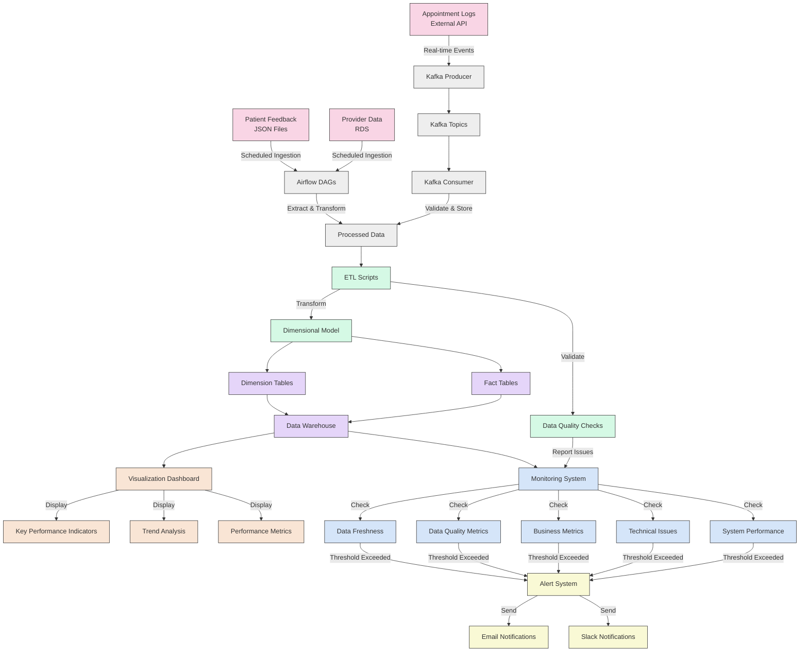

```mermaid
flowchart TD
    %% Data Sources
    DS1[Appointment Logs\nExternal API] --> |Real-time Events| KP[Kafka Producer]
    DS2[Patient Feedback\nJSON Files] --> |Scheduled Ingestion| AF[Airflow DAGs]
    DS3[Provider Data\nRDS] --> |Scheduled Ingestion| AF
    
    %% Data Ingestion
    KP --> KT[Kafka Topics]
    KT --> KC[Kafka Consumer]
    KC --> |Validate & Store| DI[Processed Data]
    AF --> |Extract & Transform| DI
    
    %% Data Processing
    DI --> ETL[ETL Scripts]
    ETL --> |Transform| DM[Dimensional Model]
    ETL --> |Validate| DQ[Data Quality Checks]
    DQ --> |Report Issues| MON[Monitoring System]
    
    %% Data Warehouse
    DM --> DIM[Dimension Tables]
    DM --> FACT[Fact Tables]
    DIM --> DW[Data Warehouse]
    FACT --> DW
    
    %% Visualization
    DW --> VIZ[Visualization Dashboard]
    VIZ --> |Display| KPI[Key Performance Indicators]
    VIZ --> |Display| TREND[Trend Analysis]
    VIZ --> |Display| PERF[Performance Metrics]
    
    %% Monitoring & Alerts
    DW --> MON
    MON --> |Check| DF[Data Freshness]
    MON --> |Check| DQM[Data Quality Metrics]
    MON --> |Check| BM[Business Metrics]
    MON --> |Check| TI[Technical Issues]
    MON --> |Check| SP[System Performance]
    
    DF --> |Threshold Exceeded| ALERT[Alert System]
    DQM --> |Threshold Exceeded| ALERT
    BM --> |Threshold Exceeded| ALERT
    TI --> |Threshold Exceeded| ALERT
    SP --> |Threshold Exceeded| ALERT
    
    ALERT --> |Send| EMAIL[Email Notifications]
    ALERT --> |Send| SLACK[Slack Notifications]
    
    %% Style
    classDef sourceClass fill:#f9d5e5,stroke:#333,stroke-width:1px;
    classDef ingestClass fill:#eeeeee,stroke:#333,stroke-width:1px;
    classDef processClass fill:#d5f9e5,stroke:#333,stroke-width:1px;
    classDef warehouseClass fill:#e5d5f9,stroke:#333,stroke-width:1px;
    classDef vizClass fill:#f9e5d5,stroke:#333,stroke-width:1px;
    classDef monitorClass fill:#d5e5f9,stroke:#333,stroke-width:1px;
    classDef alertClass fill:#f9f9d5,stroke:#333,stroke-width:1px;
    
    %% Apply styles
    class DS1,DS2,DS3 sourceClass;
    class KP,KT,KC,AF,DI ingestClass;
    class ETL,DM,DQ processClass;
    class DIM,FACT,DW warehouseClass;
    class VIZ,KPI,TREND,PERF vizClass;
    class MON,DF,DQM,BM,TI,SP monitorClass;
    class ALERT,EMAIL,SLACK alertClass;
```
